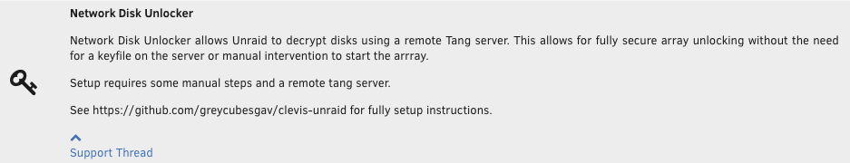

# Unraid Network Disk Unlocker

This repository holds the code to build my Unraid Network Disk Unlocker plugin.

Network Disk Unlocker allows [Unraid](https://unraid.net/) to decrypt disks using [clevis](https://github.com/latchset/clevis) bound to a remote [Tang server](https://github.com/latchset/tang). This allows for fully secure array unlocking without the need for a keyfile on the server or manual intervention to start the arrray.

<p align="center">
  
</p>

# Install Instructions

### Pre-requisites

This plugin requires access to a tang server; https://github.com/latchset/tang

The easiest way to setup a local tang server may be to use the docker image such as; https://hub.docker.com/r/padhihomelab/tang

**Note: this tang server must not be running in your Unraid server as the tang server must accesible to your Unraid server before the array is started.**

### 1. Install this Plugin in Unraid
* Browse to your Unraid Dashboard
* Navidate to Plugins -> Install Plugin Tab
* Enter the following URL `https://github.com/greycubesgav/unraid-network-disk-unlock/releases/latest/download/network.disk.unlock.plg`
* Click the [INSTALL] button

### 2. Bind your encrypted disks to your tang server

* Ensure your Tang server is running, and you know the tang server url
e.g. ``http://tang.server:port/adv``
* Open a root terminal in your Unraid server
* Run the following command `/usr/local/emhttp/plugins/network.disk.unlock/network.disk.unlock.setup.sh`
* The script will guide you through the process of attaching your encrypted disks you your tang server
* Once the script is finished adding tang binds to your encrypted disks, reboot your Unraid server

# Build Instructions

## Building the Plugin
Running the following make command will rebuild the plugin using the Dockerfile and output the resultant files in ./pkgs
```bash
make docker-artifact-build-current
```

To build the plugin without any cached docker layers

```bash
make NOCACHE='--no-cache' docker-artifact-build-current
```

## Update the plugin dependencies and rebuild

Running the following make command will update the dependencies and rebuild the plugin using the Dockerfile and output the resultant files in ./pkgs
```bash
make NOCACHE='--no-cache' update-dependencies
make docker-artifact-build-current
```
